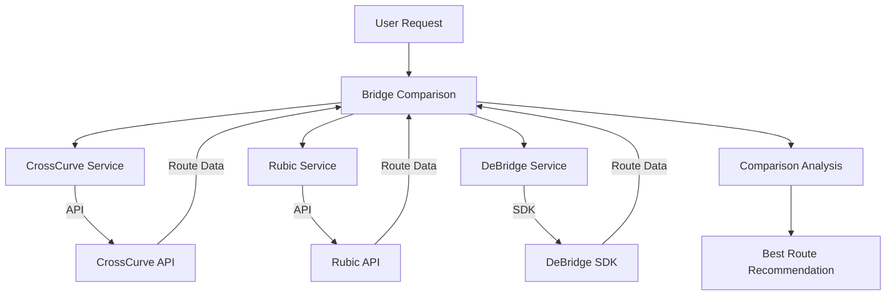
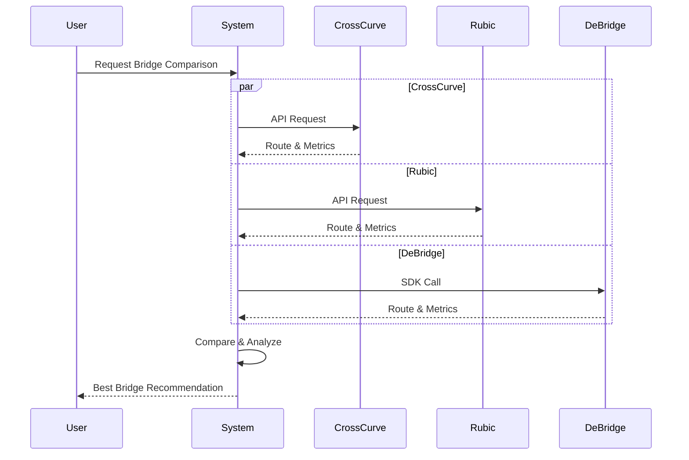
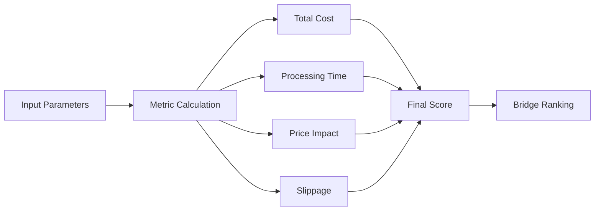

# Bridge Comparison System

A system that analyzes and compares different blockchain bridges to find the optimal route for cross-chain token transfers. The system compares metrics across multiple bridges (CrossCurve, Rubic, and DeBridge) to provide real-time recommendations.

## Table of Contents

- [Overview](#overview)
- [Architecture](#architecture)
- [Features](#features)
- [How It Works](#how-it-works)
- [Bridge Integration Methods](#bridge-integration-methods)
- [Installation](#installation)
- [Usage](#usage)
- [Configuration](#configuration)
- [Metrics & Scoring](#metrics--scoring)

## Overview

The Bridge Comparison System helps users find the most efficient bridge for cross-chain token transfers by analyzing:

- Transaction costs
- Processing times
- Slippage
- Liquidity
- Success rates
- Total efficiency

### System Architecture



## Features

- Real-time bridge comparison
- Dynamic metric calculation
- Multi-chain support
- Gas cost estimation
- Slippage protection
- Success rate tracking
- Best route recommendation

## How It Works

### Request Flow



## Bridge Integration Methods

### API-Based Bridges

1. **CrossCurve Bridge**

   - Integration: REST API
   - Endpoints:
     - `/routing/scan`
     - `/estimate`
     - `/tx/create`
   - Features:
     - Direct route queries
     - Real-time estimates
     - Transaction preparation

2. **Rubic Bridge**
   - Integration: REST API
   - Endpoints:
     - `/routes/quoteBest`
     - `/routes/quoteAll`
     - `/routes/swap`
   - Features:
     - Multiple route options
     - Best route selection
     - Swap preparation

### SDK-Based Bridge

**DeBridge**

- Integration: DeBridge SDK (@debridge-finance/desdk)
- Features:
  - Direct contract interaction
  - Message encoding
  - Submission tracking
  - Built-in validation

## Installation

```bash
# Install dependencies
npm install

# Configure environment
cp .env.example .env
```

## Usage

```javascript
const BridgeComparison = require("./src/index");

// Initialize
const bridgeComparison = new BridgeComparison();

// Compare bridges
const result = await bridgeComparison.getBestBridge({
  sourceChain: 1, // Ethereum
  destChain: 137, // Polygon
  sourceToken: "0x...",
  destToken: "0x...",
  amount: "1000000000000000000", // 1 ETH
  fromAddress: "0x...",
  receiver: "0x...",
});
```

## Configuration

Environment variables:

```env
CROSSCURVE_API_URL=https://api.crosscurve.fi
RUBIC_API_URL=https://api-v2.rubic.exchange/api
```

Chain configuration:

```javascript
const CHAIN_IDS = {
  ETH: 1,
  POLYGON: 137,
  BSC: 56,
  // ... other chains
};
```

## Metrics & Scoring

### Comparison Metrics



### Scoring Factors

- Transaction costs (gas + fees)
- Expected processing time
- Price impact
- Slippage percentage
- Historical success rate
- Current liquidity
- Bridge efficiency

### Output Example

```javascript
{
    bestBridge: {
        name: "BridgeName",
        metrics: {
            outputAmount: "0.998 ETH",
            fee: "0.001 ETH",
            gasCost: "0.0005 ETH",
            totalCost: "0.0015 ETH",
            netReturn: "0.9965 ETH",
            slippage: "0.2%",
            efficiency: "99.65%",
            estimatedTime: "300 seconds"
        }
    },
    // ... additional data
}
```

## Security Considerations

- Regular rate limit monitoring
- Error handling for failed requests
- Slippage protection
- Transaction validation
- Gas price monitoring
- Smart contract verification

## Best Practices

1. **API Requests**

   - Implement proper error handling
   - Use request timeouts
   - Cache responses when appropriate
   - Handle rate limiting

2. **SDK Usage**

   - Follow DeBridge SDK guidelines
   - Implement proper message signing
   - Handle async operations correctly
   - Validate all inputs

3. **General**
   - Monitor bridge health
   - Implement fallback options
   - Log all operations
   - Regular metric updates
